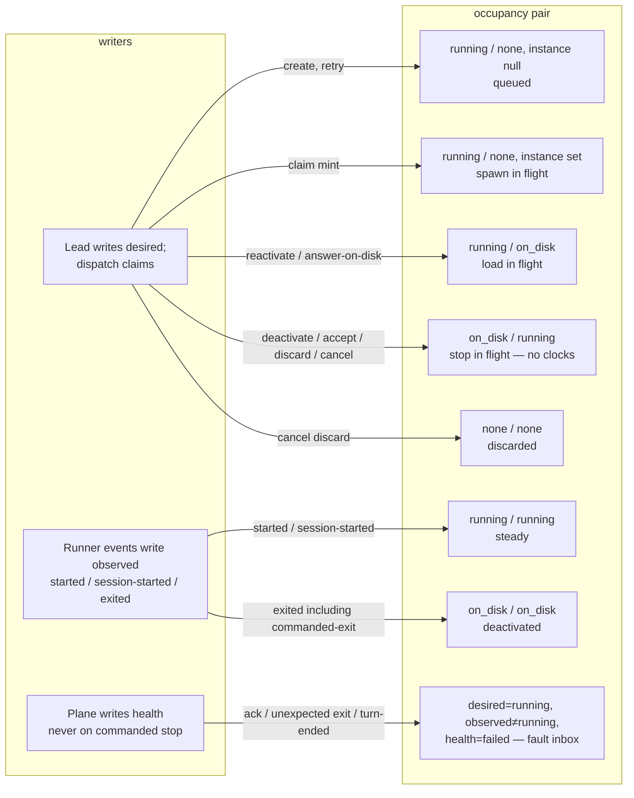
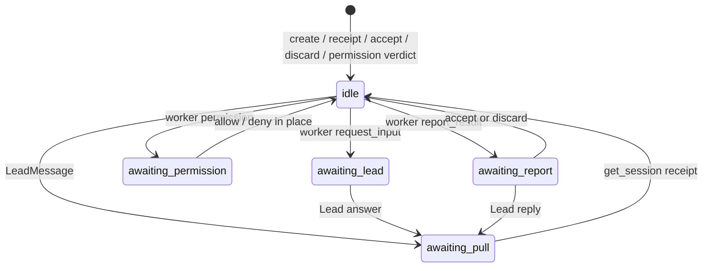

# Occupancy and the message machine

**Author:** Landbridge
**Date:** 2026-08-20
**Status:** Implemented. Condensed in [`spec.md`](spec.md) §6.
**Detail:** occupancy, health, hidden, and the message machine. Continuation targeting, pull-is-receipt, doer/judge, and `session/load` locality are in [`sessions.md`](sessions.md) and spec §11.
**Does not rewrite:** spec §7 schema prose (except occupancy/message fields), §10 MCP names, §11 permission bridge / continuation targeting, §13.

---

## Overview

Two models on the same durable row:

1. **A session is a durable object plus an occupancy reconciler.** There is no terminal state. Desired occupancy and observed occupancy share one vocabulary (`none | on_disk | running`). Intermediary names (`spawning`, `parking`, `retrying`) are not states: mismatch *is* the in-flight window. `health` is mechanical only. `hidden` is a filter, not a phase.
2. **The state machine is the message exchange.** At most one outstanding envelope per session. Busy is derived from it, never stored on the session.

Detail and command matrix for occupancy and the message machine. Spec §6 is the condensed form. Tool *names* are unchanged.

---

## Background & Motivation

Spec §6 is the present model. This section is why occupancy and the message machine exist.

### What a fused session enum mixed

Three facts hid behind one column:

| Fact | Today's encoding | What it really is |
|---|---|---|
| Should a harness be up? | `Submitted` / `Working` / `Parked` / `Failed` / terminals | occupancy desired vs observed |
| Is the process actually up? | inferred from `CurrentInstanceId`, `RunnerConnectionRegistry.HasLiveProcess`, and `state` | occupancy observed, written by runner events |
| Who owes whom a move? | `BlockedOnInput`, `Verifying`, `Working`+`BlockedAt`, `Working` with a leftover `InputKind` | the message machine |

Concrete knots this produces:

- **`Parked` is occupancy, not a verdict.** `Park` / `WaitTtlExpired` / `StopPreserveAndPark` all write `SessionState.Parked`, revoke the token, and pin `PreferredMachine` (`SessionStore.RunTransition`). The row is then a phase the engine treats as distinct from `Failed`, which is the same release the Lead did not ask for.
- **`Completed` / `Rejected` / `Canceled` are filters pretending to be physics.** `SessionStateExtensions.IsTerminal` refuses every later command (`Rule.TerminalStatesAreFinal`). Continuations of a completed session already work (`ReadContinuationSourceAsync` reads instance rows of revoked instances). The engine's "never resumed" and the product's "new work is a new session id that may `session/load` the old transcript" disagree; the store papers over it by not going through the old row.
- **A question is not a phase.** `ApplyRequestInput` leaves `Working` for every kind except `Permission`, which alone becomes `BlockedOnInput`. `IsAwaitingLeadAsync` then re-derives "idle for the Lead" from `BlockedAt` + `InputKind`. The state column cannot say this; a sidecar can.
- **Dispatch claims `state = 'Submitted'`** (`SessionStore.DispatchNextAsync`). After the claim the row is `Working` *before* the spawn is sent (`DispatchService.TryDispatchOneAsync`: SKIP LOCKED, mint token, then best-effort send). Ack timeout is `LivenessLost(AckTimeout)` → `Failed`. There is no honest name for "desired running, observed none."
- **`submit_review(fail)` is a session phase (`Rejected`).** Stage 3 of `sessions.md` already decided a fail is not a redispatch and more work is a reply. The remaining damage is treating discard as terminal and blocking `continues:` behind `IsTerminal` mythology rather than health.

### As-built that this spec keeps

`sessions.md` stages 1–5 and the current engine already hold:

- No automatic requeue. `ApplyLivenessLost` goes to `Failed`, not `Submitted`. The infrastructure counter is incremented; it does not drive a loop.
- A report keeps the process (`ApplyReportResult` does not revoke).
- Permission is the live wait; prose questions may end the turn (`RequestInput` of non-permission stays `Working`).
- Pull-is-receipt: `PromptCommand` carries no text (`Landbridge.Contracts.PromptCommand`); the worker reads `get_session`.
- `session/load` is machine-local; park/fail pin `PreferredMachine` + `OnMachineGone = Pin`.
- ACP permission via plane `POST /worker/permission`; classifier/legacy allow maps to `allow_once`.
- Doer/judge: `ApplyVerdict` refuses a `WorkerCaller`.
- Wait TTL off by default (`WaitTtlSweeper.DefaultWaitTtl = InfiniteTimeSpan`).
- Review-mode: the plane does not refuse a Lead accept.

What it did not do is stop calling those facts a single enum.

---

## Goals & Non-Goals

**Goals**

- Split occupancy from the Lead↔worker exchange so neither is encoded as a session lifecycle phase.
- Delete terminal session states. Hidden-by-default is the list filter between "open" and "done." Same-id commands on hidden rows are refused (command matrix); new work is a new session id.
- Delete `Parked` and `Rejected` as session states. Deactivate is occupancy. Accept/discard is a message verdict plus hide.
- Keep one outstanding message per session, with pull-is-receipt recorded (default; see Open Questions).
- Make dispatch claim on occupancy, not on `Submitted`.
- Make mechanical failure (`health=failed`) distinct from "the worker cannot do this work" (a report, then Lead accept/discard).
- Preserve the standing constraints listed below, including MCP tool names.

**Non-goals**

- MCP Tasks as a session or message machine.
- Renaming `report_result` or `submit_review`.
- Changing pull-is-receipt (answers still never ride spawn argv or `PromptCommand`).
- Auto-requeue, auto-merge (`--merge` / `--rebase`; squash only, N/A except PR plan).
- ACP protocol 2, generated ACP clients, ACP-shaped MCP tools.
- A standing `allow_always` grant (classifier/legacy allow stays `allow_once`; an explicit Lead pick of a harness `allow_always` option is still sent through).
- Rewriting spec.md in this change (this file is the replacement text for §6).
- Skill-bundle edits (later PR).
- Enacting workspace discard (still a recorded intent; `DiscardWorkspace` remains a no-op in the store).
- Moving `session/load` across machines (#175).
- A `messages` history table. One envelope on the row is the machine; `session_events` remains the trail.

---

## Standing constraints

Do not violate. Restated here because several are easy to break while splitting the enum.

- No keys in repo.
- ACP permission via plane `POST /worker/permission`.
- No spawn bypass / `allow_always` as a standing grant. Classifier or legacy allow → `allow_once`. Explicit Lead pick of a harness `allow_always` option is allowed and is sent through.
- Pull-is-receipt. Answers never ride spawn argv or the doorbell `prompt` (empty prompt; worker pulls). Permission is the exception: in-place verdict into the blocked tool call.
- Doer/judge: only a Lead or human may accept/discard a report. A session's own worker cannot. The plane does not refuse a Lead accept.
- No auto-requeue. Mechanical fail sets `health=failed` and stops. The Lead retries.
- Report keeps the process until Lead accept, discard, or reply.
- Waiting may occupy seats. Back-pressure is what `landbridged` observes. There is no `max_concurrent`.
- Token valid while the instance is live. Revoke when leaving `running`, or on instance death.
- New work = new session id. Optional `create_session(continues:)` reuses another row's harness transcript under the new id.
- `session/load` is machine-local.
- Work-dir GC is skill advice.
- Spend is observability plus the operator's provider key limits.
- ACP client stays hand-rolled; protocol 1 only.
- No ACP-shaped MCP tools.
- Do not rename `report_result` / `submit_review`.
- Do not change pull-is-receipt.

---

## Key Decisions

1. **A session has no lifecycle enum and no terminal state.** Occupancy + health + hidden. `IsTerminal` is deleted.
2. **Occupancy vocabulary is identical on desired and observed:** `none | on_disk | running`. Lead writes desired; dispatch claims a row whose desired is already `running`. Observed is runner events (`started` / `session-started` / `exited`, not `alive`). Mismatch is in-flight. Do not add `spawning` / `parking` / `retrying`.
3. **`health` is mechanical only.** Handshake, process death, machine gone, ack/liveness/no-progress, turn-ended-without-result. "I cannot do this work" is a report, then accept/discard.
4. **`hidden` is a default-off list filter, not `IsTerminal`.** Accept and discard both set `hidden=true`. Same-id wake of a hidden **healthy** row is **refused** (command matrix in §4). **Hidden + `health=failed` still allows same-id retry** (`answer_input_request`) so clearing the fault inbox does not trap the transcript. `create_session(continues:)` still refuses `health=failed` (retry is the same id, not a continuation). New work remains a new session id. There is no unhide. `ObserveOccupancy` is always allowed.
5. **Park-as-state is deleted.** Deactivate is `desired=on_disk`. The MCP tool stays `park_session` (names frozen). The row is never called `Parked`. `ParkRecord` remains preferred-machine affinity, not a state. Deactivate and wait-TTL are **refused** while `awaiting_permission` (the waiter is live in-process; occupying the seat is the point).
6. **Rejected-as-state is deleted.** `submit_review` verdict `fail` becomes discard-into-hidden. Verdict lives on the message (`accepted` | `discarded`), with provenance.
7. **Canceled-as-state is deleted.** Cancel is an action: stop, optional workspace-discard intent, `hidden=true`.
8. **The message machine is the only session state machine**, one outstanding envelope, worker transitions from `idle` only, incumbent instance only.
9. **Busy is derived from the message machine**, never stored on the session.
10. **Retry of `health=failed` is `session/new` on the same session id, not `session/load`.** Failed sessions cannot be continued (`create_session(continues:)` refuses `health=failed`). Wake of a *healthy* `on_disk` row is `session/load`.
11. **No auto-requeue**, including at the infrastructure cap. The cap remains an observability counter; it does not abandon the row into a terminal enum.
12. **Pull-is-receipt is recorded** (default; Open Questions). `get_session` while `awaiting_pull` is the transition to `idle`.
13. **Deactivate-without-hide stays a Lead tool** (default; Open Questions). Waiting occupies seats; wait TTL is off by default, so an explicit occupancy release is required.
14. **Retry tool is `answer_input_request` on a failed row** (default; Open Questions). No new `retry_session` in this spec. Spawn kind is `new`.
15. **Canceled-row migration:** `preserve` (or unknown disposition) → `hidden=true`, `desired=on_disk`; recorded `discard` → `hidden=true`, `desired=none` (default; Open Questions). Discard is recoverable iff the cancel event’s `detail` names `DiscardWorkspace` (or `DeferWorkspaceDiscardUntilVerdict`). Missing events default to preserve; no second-pass repair.
16. **Runner auto-prompt is the doorbell for spawn and load.** After `session/new` or `session/load`, `AcpClient.DriveAsync` already sends the opening prompt or profile `FollowUpTurn`. The plane sends `PromptCommand` **only** when `observed=running` **and** `HasLiveProcess` (Lead talking to a process the registry still holds). Occupancy lag is not a substitute for the in-memory flag: if observed says running but the registry says gone, take the on-disk path (`pending_spawn=load`, no prompt) **and revoke/null `CurrentInstance` in that same write** — the incumbent is the dead predecessor, not a Dispatch-minted successor. Leaving the instance set makes the following `ObserveOccupancy(exited)` look like spawn-in-flight fail (`hadInstance` true). No `PromptCommand` on ObserveOccupancy, and none on a freshly claimed dispatch. Runner wire and runner behavior are unchanged (doorbell A).
17. **Clocks key on `desired=running`, not merely `observed=running`.** Aliveness and progress apply to a live attempt (`desired=running` ∧ instance set). Commanded stop (`desired∈{on_disk,none}`) never moves `health`. Spawn-in-flight (`instance set`, `observed≠running`) is covered by the ack/aliveness window, not treated as queued `Submitted`.
18. **`ObserveOccupancy` is a runner fact, always applicable.** Exempt from `IsTerminal` / hidden. Commanded-exit **must** write observed (and null instance if still set) and **must not** `LivenessLost`. Occupancy-only (keep `pending_spawn`, do not change health) applies **only** when `pending_spawn ∈ {new,load}` **and** `CurrentInstance` was already null — the successor has not been minted; this is the predecessor echo after retry/answer-on-disk. If instance **was** set, this is the **Dispatch-minted successor** dying (spawn-in-flight): `health=failed(ProcessExited)`, clear `pending_spawn`. A Lead persist of `pending_spawn` while `!HasLiveProcess` must have already nulled the predecessor so that echo cannot take this row. `alive` is the in-memory clock, not an xmin occupancy write. `LivenessLost` itself drops `observed` to `on_disk`/`none` so the fault inbox is not `observed=running` with a nulled instance.
19. **`CurrentInstance` and the token drop when observed leaves `running`, except commanded stop already revoked on the stop command.** Expected question-exit also sets `desired=on_disk` so the row is not claimable until the Lead answers, and **pins** `PreferredMachine` + `OnMachineGone=Pin` (same as today's fail/park path) so a later load is machine-local. Death while `awaiting_pull` is **one** redelivery (`pull_redelivered`): null instance, `pending_spawn=load`, keep `desired=running`, pin. A second death before pull is `health=failed(ProcessExited)`, not another load — that is the standing no-auto-requeue constraint.
20. **`pending_spawn` null is not claimable.** Dispatch does not infer load from `HarnessSessionRef`. A leftover ref after retry is why the column exists. The column is **not consumed at claim**; it stays `new`/`load` until `ObserveOccupancy(running)` or a fail/retry overwrites it.
21. **Retry while the predecessor is still dying persists; it does not reject and does not spawn.** `answer_input_request` on failed writes `health=ok`, `pending_spawn=new`, `desired=running` and returns Applied. Dispatch will not claim until `observed∈{none,on_disk}` and instance is null and `HasLiveProcess` is false. The predecessor's `exited` is occupancy-only because `pending_spawn` is already `new` **and instance is already null**. A death **after** claim (instance set, `pending_spawn` still set until `session-started`) is the successor failing, not occupancy-only.

---

## Proposed Design

### 1. Session = durable row + occupancy reconciler

A session is created, addressed, and continued by id. It is never "over" as far as the engine is concerned. The Lead hides it; a later `create_session(continues:)` may still target it if it is healthy and has a transcript.

#### Fields (occupancy half)

```
occupancy.desired    none | on_disk | running     // Lead / dispatch
occupancy.observed   none | on_disk | running     // runner events
health               ok | failed(reason)          // plane, mechanical only
hidden               bool                         // filter; default-hide
pending_spawn        new | load | null            // set when desired becomes running; NOT consumed at claim; cleared on ObserveOccupancy(running) or overwritten by fail/retry
pull_redelivered     bool not null default false  // one awaiting_pull death may load; a second fails
```

`reason` on failed is today's `LivenessLossReason` (`AckTimeout`, `LivenessTimeout`, `NoProgress`, `ProcessExited`, `MachineReboot`, `TurnEndedWithoutResult`).

`ParkMachine` / `PreferredMachine` / `OnMachineGone` / `HarnessSessionRef` stay. They are affinity and resume metadata, not occupancy.

#### Occupancy meaning

| Value | Meaning |
|---|---|
| `none` | No ACP session. Never spawned, or discarded (workspace gone as intent). |
| `on_disk` | A harness transcript exists (or is believed to: `HarnessSessionRef` stamped). Harness process is not running. |
| `running` | Harness process is up. |

Steady pairs: `desired == observed` (`running/running`, `on_disk/on_disk`, `none/none`).

In flight (not states):

| desired / observed | Meaning |
|---|---|
| `running` / `none` | Queued or first spawn in flight. |
| `running` / `on_disk` | `session/load` in flight. |
| `on_disk` / `running` | Stop in flight (`session/cancel` + kill deadline). |
| `none` / `running` | Discard-stop in flight. |
| `none` / `on_disk` | Discard of a preserved transcript in flight (intent; GC is not enacted today). |

Fault inbox: `desired` still `running`, `observed` not `running`, `health=failed`, instance null.

Queued view: `desired=running`, `observed=none`, `health=ok`, **`current_instance_id IS NULL`**, `pending_spawn` in `{new,load}`.

Spawn-in-flight (not queued): `desired=running`, `observed=none`, **instance set**, `health=ok`. Dual-write `Working`, not `Submitted`. Covered by ack/aliveness, not by a second claim.

#### Who writes which

- **Lead writes `desired`.** Create, reactivate, retry, deactivate, accept/discard, cancel. **`Dispatch` does not write desired**; it claims a row whose desired is already `running` (claim-before-send).
- **Runner events write `observed` via `ObserveOccupancy` (xmin).** `started` and `session-started` → `running`. `exited` → `on_disk` if `HarnessSessionRef` is set, else `none`. **`alive` does not write occupancy** — it is the ~15s in-memory aliveness ping (`RecordAlive`) as today. Optional repair only: `UPDATE … SET occupancy_observed='running' WHERE occupancy_observed <> 'running'` if a started event was lost. Do not dual-purpose occupancy as a heartbeat.
- **Commanded-exit still must `ObserveOccupancy`.** Today `HandleExitedAsync` returns on `ConsumeCommandedExit` with no store write (the requeue already happened). Under occupancy that swallow is the `exited` that completes stop-in-flight. The echo must not `LivenessLost`, and must not be a no-op on observed.
- **Plane writes `health`** from mechanical signals only (`LivenessLost`), and **never** on commanded stop. Same command as today, different effect: no lifecycle enum, no requeue.
- **Accept / discard write `hidden=true`** and `desired=on_disk`, then emit `StopCommand` (not as-built today; see §3).

`StampHarnessSessionRefAsync` remains a targeted column write (transport metadata, no xmin). Observed occupancy is load-bearing and goes through the store with the row's xmin.

`ObserveOccupancy` is a `SessionCommand` **exempt from `IsTerminal` and from hidden.** It is a runner fact. Introducing it in the same PR as the sink change, while accept still writes `Completed`, is why the exemption cannot wait for the terminal-deletion PR.

#### Rules, not states

**One instance fence.** No spawn until the predecessor process is gone. Today's constraint (`ideas/spec.md` §11, `SupersededInstanceTests`, zombie+load transcript corruption): revoking a token does not end a process, and `session/load` of a transcript a live writer still holds interleaves two writers. Dispatch must not send `dispatch` while `observed=running` or while `RunnerConnectionRegistry.HasLiveProcess` is true for that session id. A retry requested before `exited` **persists** (`health=ok`, `pending_spawn=new`) and returns Applied; it does not reject and it does not queue a second process. Claim waits for occupancy catch-up.

**Dispatch still claims before send.** `DispatchNextAsync` SKIP LOCKED, mint instance + token, then best-effort spawn (`DispatchService.TryDispatchOneAsync`). After the claim: `desired` stays `running`, `observed` still `none` or `on_disk`, `CurrentInstance` set, `Attempt++`. Failed send → `LivenessLost(AckTimeout)` → `health=failed`. Do not invent `spawning`. Ack timeout is health, not a phase.

**Stop** is `session/cancel` plus a kill deadline (`StopCommand`). **As-built, only `park_session` sends `StopCommand`.** `submit_review` and `cancel_session` only `ApplyAsync` (token revoke + clear services; the process becomes a stray until the next liveness scan untracks terminals). This spec makes accept, discard, cancel, and deactivate all emit `StopCommand` after the store commit when `observed=running` or an instance is still live — a real behavior change, listed on those tools. Deactivate / accept / discard / cancel-preserve set `desired=on_disk` while `observed=running` until `exited`. Commanded stop **never** moves `health`; `ObserveOccupancy` on the echo completes the pair.

Stop TTL/disposition (plane → runner):

| Action | `StopCommand` disposition | TTL |
|---|---|---|
| `park_session` / deactivate | `PreserveAndPark` | 30s (today's `ParkTask`) |
| `submit_review` accept or fail (discard) | `Preserve` | 30s |
| `cancel_session(preserve)` | `Preserve` | 30s (Lead may still pass TTL=0 via runner kill; unchanged) |
| `cancel_session(discard)` | `Discard` | 30s |

Workspace discard remains a recorded intent (`DiscardWorkspace` no-op).

**Token** is revoked on the Lead/plane command that leaves `desired=running` (authorization ends when the plane decides the instance is done). `ObserveOccupancy(exited)` nulls `CurrentInstance` if still set (death before the command revoked, or a race). Observed catching up does not mint a new token.

**Retry** (`health=failed` → Lead asks to try again): set `health=ok`, keep `desired=running`, `pending_spawn=new`, do **not** `session/load`. The old transcript may still be `on_disk`; it is not reused. Failed sessions cannot be continued: no load, no `create_session(continues:)` from `health=failed`.

**Wake / reactivate same id** (healthy + `on_disk`): `desired=running`, `pending_spawn=load` → `session/load` on the pinned machine.

**New work** is a new session id. `create_session(continues:)` stays: same-Team, seeds `HarnessSessionRef` + preferred machine + work-dir inheritance (`LeadTools.CreateSession`, `Continuation`). Continue is allowed from hidden (ex-completed) **healthy** sessions that have a transcript. Refused from `health=failed`. Never-dispatched source still refused (no transcript, no directory).

**`desired=none`** is discard (workspace-gone intent). Preserve-stop is `on_disk`. Nothing enacts discard today (`DiscardWorkspace` no-op); the column records the intent so a later enactor can tell preserve from discard without a `Canceled` enum. A discard must not delete a directory a continuation merely borrowed (§11).

**Token** lives with the instance (`MintWorkerInstanceToken` / `RevokeWorkerInstanceToken`). A session held idle in `running/running` still holds its credential. Revoke is the stop/death path above, not a second lifetime.

**Busy is not stored on the session.** Derived from the message machine (below).

#### Occupancy × message: who occupies a seat

A session occupies a machine seat when `observed=running` (in-flight spawn `running/none` is queued, not seated, until `started`). Waiting may occupy: `awaiting_lead` with process still up, `awaiting_permission`, `awaiting_report`, `idle`+`running/running` (the worker is doing the work). Deactivate is how a Lead frees the seat without hiding the row.



### 2. Message machine

At most **one** outstanding exchange per session. This is the state machine `SessionStateMachine` becomes.

#### States

| State | Meaning |
|---|---|
| `idle` | No outstanding envelope. If occupancy is `running/running`, the worker is doing the work. |
| `awaiting_lead` | Worker asked a prose question (or `spawn_request` / `auth_help` / `endpoint_wait` / `unreachable`). Lead answers in words. |
| `awaiting_permission` | Live ACP `session/request_permission`. Verdict in place. `observed` must be `running`. |
| `awaiting_report` | Worker claimed done, or cannot do the work, via `report_result`. Lead accepts, discards, or replies. Process stays. |
| `awaiting_pull` | Lead spoke. Worker must `get_session`. That call is the receipt. |

Envelope payload stays on the row, as today: `InputKind`, `InputQuestion`, `InputAnswer`, `PermissionTool` / `Options` / `OptionId` / `Verdict` / escalation fields, `WorkerReport`, `ResultReference`. Add:

```
message_state          idle | awaiting_lead | awaiting_permission | awaiting_report | awaiting_pull
message_authorship     worker | lead_or_human     // who opened the outstanding envelope
message_verdict        accepted | discarded | null  // last report adjudication; not a session phase
message_pulled_at      timestamptz | null           // receipt; set on get_session from awaiting_pull
```

`CompletionProvenance` (`lead-session` | `human`) moves onto the last accept (same derivation as `ApplyVerdict` today). Discard records the same provenance class.

#### Transitions

Worker, from `idle` only, incumbent instance (`RequireIncumbent`, §9 check 14):

| From → to | Trigger |
|---|---|
| `idle` → `awaiting_lead` | `request_input` with a non-permission kind |
| `idle` → `awaiting_permission` | permission bridge (`RequestInput` kind `Permission`, or `POST /worker/permission`) |
| `idle` → `awaiting_report` | `report_result` (result reference required, report size-capped) |
| `idle` → `awaiting_pull` | not a worker move; see LeadMessage |

Lead / human:

| From → to | Trigger | Occupancy / hidden |
|---|---|---|
| `awaiting_lead` → `awaiting_pull` | `answer_input_request` (prose) | if `observed=on_disk` (or `none`), set `desired=running` and `pending_spawn=load` (or `new` if no ref). Plane does **not** `PromptCommand`; the runner's post-`session/load` `FollowUpTurn` is the doorbell |
| `awaiting_permission` → `idle` | `answer_permission_request` allow/deny in place | occupancy unchanged; process stays `running` |
| `awaiting_report` → `awaiting_pull` | `answer_input_request` reply / more work | unhidden; `desired` stays `running` |
| `awaiting_report` → `idle` | `submit_review(accept)` or `submit_review(fail)` (fail = discard) | `hidden=true`, `desired=on_disk`, verdict recorded on the message |
| `awaiting_pull` → `idle` | worker `get_session` (incumbent) | occupancy unchanged |

`LeadMessage` (Lead spoke first, no pending question; today's `answer_input_request` on a live `Working` row with no wait, or a follow-up): `idle` → `awaiting_pull` if `observed=running` (plane `PromptCommand` after commit — the only PromptCommand path). If the process is gone, set `desired=running` and `pending_spawn=load` (or `new` if no ref); the runner's post-load `FollowUpTurn` is the doorbell, same as answering a question on disk. Hidden rows refuse this (command matrix).

Permission and prose refuse each other's paths (`Rule.PermissionVerdictAnswersPermissionRequests`). Unchanged.

Escalate permission: still not a state change. Authority flag on the envelope (`PermissionEscalatedAt` / `Reason`). `Rule.EscalatedPermissionIsHumanOnly` unchanged.



#### Pull-is-receipt (recorded)

Today `GetAssignmentAsync` is a pure `AsNoTracking` read and stamps nothing (`sessions.md`: "the receipt is inferable but not recorded"). This spec makes it a recorded transition, as a **compare-and-set**, not a load-then-save on the xmin row next to unrelated writers:

```
UPDATE sessions
   SET message_state = 'idle',
       message_pulled_at = now(),
       pull_redelivered = false
 WHERE id = $id
   AND message_state = 'awaiting_pull'
   AND current_instance_id = $incumbent
 RETURNING <assignment columns>;
```

- 1 row: that is the receipt. Return those columns (the assignment the worker just acknowledged).
- 0 rows: fall back to today's `AsNoTracking` incumbent read (already `idle`, or not incumbent → null). A second concurrent `get_session` from the same instance is the 0-row path and still returns the assignment; it does not `Conflict`.
- Anyone else still gets null (zombie / cross-task learns nothing).

**Pull vs nudge.** `LeadMessage` while `awaiting_pull` must persist `InputAnswer` even if a receipt commits first. If the receipt wins, the nudge is a new `LeadMessage` on `idle` (`idle` → `awaiting_pull`) and, iff `observed=running` ∧ `HasLiveProcess`, the plane `PromptCommand`s. If the nudge wins, the subsequent pull receipts the new text. Do not drop a Lead note on xmin conflict with the receipt UPDATE.

**Pull vs `ObserveOccupancy`.** Different columns. xmin collision: retry the receipt UPDATE (same WHERE); 0 rows then means occupancy moved the instance and the fallback read returns null if the token is no longer incumbent.

Tests: pull vs nudge, double pull, pull vs ObserveOccupancy.

Cost: one conditional PK update on the path that already needed observability. Opening `get_session` on a fresh spawn (`idle`) does not invent a receipt.

The doorbell payload remains empty. Content never rides argv. Permission is the exception: verdict returns in process via `POST /worker/permission` / `AnswerPermission`. No `get_session` receipt on that path.

#### Authorship and doer/judge

An outstanding envelope carries `message_authorship`. Accept/discard are legal only from a Lead claim for the Team or a `HumanSession`, and only while `awaiting_report`. A `WorkerCaller` is refused (`Rule.CompletionByLeadOrHuman`). The plane does not refuse a Lead accept (no evidence gate, no review-mode check).

#### Busy (derived)

```
lead_busy    = message in { awaiting_lead, awaiting_permission, awaiting_report }
worker_busy  = message in { awaiting_pull, awaiting_permission }
```

`idle` + `running/running` = worker doing the work; occupying a seat; **not** busy. Today's `get_team_state` cannot say this; it reports `Working` for both "cranking" and "waiting on the Lead with a question."

### 3. Coupling

These are the only legal joints between the two models.

**Permission requires `observed=running`.** `RequestInput(Permission)` and the permission poll refuse otherwise (`Rule.PermissionWaiterStillIncumbent` already covers a missing incumbent; extend to observed). Process stays `running` for the wait. Process death during permission is mechanical fail. **Deactivate and wait-TTL refuse while `awaiting_permission`.** A parked permission waiter cannot receive an in-process verdict, and retry (`session/new`) is the failed path, not this one. The Lead verdicts or the wait occupies the seat. Machine-death-while-permission stays `health=failed`.

**Question may exist while `on_disk`.** `awaiting_lead` + `desired=on_disk` is a deactivated question *or* an expected process death (ObserveOccupancy sets `desired=on_disk` on that exit so the row is not auto-claimed). Answer sets `desired=running`, `pending_spawn=load`, message `awaiting_pull`. Plane does not `PromptCommand`; dispatch + runner `session/load` + `FollowUpTurn` is the doorbell.

**Report keeps the process.** `idle` → `awaiting_report` does not change occupancy, does not revoke, does not `ClearServicesAndForwards`. Accept/discard then `desired=on_disk` (stop in flight) and `hidden=true`. Reply (`LeadMessage` / `answer_input_request`) stays `running`, unhidden, `awaiting_pull`.

**Accept / discard.** Message `idle`, `hidden=true`, `desired=on_disk`, `ClearServicesAndForwards`, token revoke, **then `StopCommand(Preserve)`** from `LeadTools.SubmitReview` / the human dashboard twin if `observed=running` or an instance is live. Today those tools do not stop; this is the behavior change that prevents a live process after a verdict (and prevents Issue 1's clocks from seeing `idle`+`observed=running`+`desired=running`). Verdict on the message, not a session phase. Commanded-exit then `ObserveOccupancy`s; it does not set `health=failed`.

**Mechanical fail.** `health=failed`. Observed drops on process death (`exited` / aliveness / machine gone). Do not load on retry. **Pending message (default):** keep the last envelope for display (kind, question, report, reason) so the inbox can say what was in flight; `message_state` remains until retry. **Retry** sets `health=ok`, `hidden=false`, `pending_spawn=new`, `message_state=idle` (or `awaiting_pull` if the Lead's retry call carried a note — that note is a fresh Lead envelope, not a resurrection of the dead wait). Do not `session/load`. Persist even if the predecessor is still dying (KD 21).

**Answer while `on_disk` — exact sequence** (do not prompt a process that is not there):

```mermaid
sequenceDiagram
    participant Lead
    participant Store as SessionStore
    participant Disp as DispatchService
    participant Runner as landbridged
    participant W as Worker

    Note over Store: awaiting_lead, desired=on_disk, observed=on_disk, health=ok
    Lead->>Store: answer_input_request(answer)
    Store->>Store: persist InputAnswer<br/>message=awaiting_pull<br/>desired=running, pending_spawn=load
    Note over Store: no PromptCommand on the load path
    Disp->>Store: DispatchNext SKIP LOCKED<br/>(desired=running, observed=on_disk, health=ok,<br/>hidden=false, instance null, pending_spawn=load)
    Store->>Store: mint instance+token, Attempt++
    Disp->>Runner: dispatch(ResumeSessionRef)
    Note over Disp,Runner: DispatchCommand has no follow-up field
    Runner->>Runner: session/load (predecessor process gone)
    Runner->>W: FollowUpTurn (profile text, as-built AcpClient)
    Runner->>Store: session-started / started
    Store->>Store: ObserveOccupancy running; clear pending_spawn
    Note over Disp: no PromptCommand on this path
    W->>Store: get_session CAS awaiting_pull→idle
    Store-->>W: description + answer
```

`DispatchCommand` has no follow-up field (`RunnerContract.cs`). `AcpClient.DriveAsync` already prompts after load: `ResumeSessionRef` set → profile `FollowUpTurn` (“read your assignment”); else the opening prompt. A plane `PromptCommand` after that would `TryQueueFollowUp` a **second** turn. So:

- **Spawn/load doorbell = runner auto-prompt (as-built).** Plane never `PromptCommand` on a freshly claimed dispatch.
- **Live doorbell = plane `PromptCommand`.** Iff `observed=running` **and** `HasLiveProcess`. Occupancy is not a substitute for the in-memory flag on this turn: `ObserveOccupancy(exited)` lags the Lead call. If observed says running but the registry says gone (`MarkProcessGone` already), take the **on-disk path**: persist `pending_spawn=load`, **revoke and null `CurrentInstance` in the same write**, pin, no `PromptCommand`. As-built `HandleExitedAsync` for an awaiting-Lead death `MarkProcessGone`s and does **not** null the instance — the lag path must. Otherwise the later `ObserveOccupancy(exited)` sees `hadInstance` true and treats the predecessor as a failed successor.
- **No ObserveOccupancy → PromptCommand.**

If `observed` is already `running` **and** `HasLiveProcess`, skip dispatch: persist answer, `awaiting_pull`, `PromptCommand` immediately.

If `health=failed`, this path is retry, not load: `pending_spawn=new`, no `ResumeSessionRef`, message starts `idle` unless a note was supplied (`awaiting_pull`). Runner auto-prompts after `session/new`.

A subsequent `LeadMessage` while already `awaiting_pull` and `observed=running` **and** `HasLiveProcess` re-sends `PromptCommand` (nudge). Persist the text even if a receipt wins first (§2). If `!HasLiveProcess`, same on-disk path as above.

**Services and forwards.** Register iff `observed=running` **and** the caller is the incumbent. **Message state does not gate register.** That is a behavior change: today `RegisterServiceAsync` refuses `state != Working`, so a worker in `Verifying` (`awaiting_report`) cannot register. Under this spec it may — the process is up, a report is not a yield, and check 11 consumers still need a live endpoint while the Lead adjudicates. Same for `awaiting_lead` / `awaiting_permission` / `idle`+running. Tests: a verifying worker may `register_service`; accept still `ClearServicesAndForwards`. Spec §8.2 / check 11 language “owned by a `working` task” is amended to **`observed=running`**.

`ClearServicesAndForwards` fires when leaving `running` because of deactivate / accept / discard / cancel / mechanical fail — not on report, not on permission, not on question. The old “exception compounds” note in `Effects.cs` (permission-blocked then parked still holding services) is fixed by refusing deactivate while `awaiting_permission`, and by clearing on the fail that actually leaves `running`.

**Continuation targeting.** Unchanged SQL affinity (`preferred_machine` / `on_machine_gone`) except the claim predicate (below). Degrade still nulls `HarnessSessionRef` for that dispatch and keeps `WorkDirSessionId`. Continue refuses `health=failed` at `create_session` time in `LeadTools` (and again in the engine as defense in depth). Hidden is not a barrier.

### 4. Engine commands

`SessionCommand` remains the only write vocabulary. Mapping from today:

| Today | Becomes |
|---|---|
| `CreateSession` | same; row starts `desired=running`, `observed=none`, `health=ok`, `hidden=false`, `message=idle`, `pending_spawn=new` |
| `Dispatch` | same claim+mint; does not write a lifecycle enum; refuses unless claim predicate holds and fence is clear |
| `LivenessLost` | `health=failed`, increment `InfrastructureRequeues`, set `LastRequeueReason`, revoke, clear services, **drop `observed` to `on_disk` if ref else `none`**, pin `PreferredMachine` + `OnMachineGone=Pin`; **does not** set desired to `on_disk` (fault inbox keeps `desired=running`); does not requeue. **Refused unless `desired=running` and the fenced instance is still incumbent** (commanded stop is not a fail; a retry that already nulled the instance will not re-fail). |
| `ReportResult` | `idle` → `awaiting_report`; occupancy unchanged |
| `VerdictAccept` | accept: `idle` + `hidden` + `desired=on_disk` + `message_verdict=accepted`; plane then `StopCommand(Preserve)` |
| `VerdictFail` | discard: same occupancy/hidden/stop, `message_verdict=discarded`. MCP still sends `fail`. Engine name may stay `VerdictFail` (less churn) or become `VerdictDiscard` in the Core PR; MCP string does not change |
| `RequestInput` | `idle` → `awaiting_lead` or `awaiting_permission` |
| `AnswerInput` / `ContinueSession` / `WakeParked` | split by occupancy+health+hidden, not by `Parked`/`Failed`/`BlockedOnInput` (see matrix and `AnswerOrWakeAsync` below) |
| `AnswerPermission` | gated on `awaiting_permission` + `observed=running` |
| `EscalatePermission` | gated on `awaiting_permission` + Lead/human; **does not** require `observed=running` (authority flag only) |
| `Park` / `StopPreserveAndPark` / `WaitTtlExpired` | `Deactivate`: `desired=on_disk`, write park-machine affinity, revoke, `StopCommand(PreserveAndPark)`; **not hidden**; message unchanged. **Refused while `awaiting_permission`.** |
| `LeadMessage` | `idle` or `awaiting_report` → `awaiting_pull` |
| `Cancel` | stop (`desired=on_disk` or `none` by disposition) + `hidden=true` + `StopCommand`; no `Canceled` enum |
| `ObserveOccupancy` | runner fact; always applicable; never a health transition |

#### Command matrix (replaces `IsTerminal`)

Same-id commands. `create_session(continues:)` is a **new** id and is not in this table (allowed from hidden healthy+transcript; refused from `health=failed`).

| Command | `hidden=false`, health ok | `hidden=true`, health ok | `health=failed` (hidden or not) |
|---|---|---|---|
| `ObserveOccupancy` | apply | apply | apply |
| `Dispatch` | claim predicate | never (`hidden=false` in SQL) | never (`health=ok` in SQL) |
| `ReportResult` / `RequestInput` | if `idle` + incumbent | refuse | refuse |
| `Answer` / `LeadMessage` / reactivate | per routing below | **refuse** — new work is a new session id | **retry** (same id): `health=ok`, **`hidden=false`**, `pending_spawn=new`, `desired=running`; note → `awaiting_pull` else `idle` |
| `VerdictAccept` / `VerdictFail` | if `awaiting_report` | refuse (already judged) | refuse |
| `Deactivate` / wait-TTL | yes, except `awaiting_permission` | refuse / no-op | refuse (retry or leave in inbox) |
| `Cancel` | yes | refuse / no-op | hide + stop intent; health stays failed; same-id retry still allowed |
| `AnswerPermission` | if `awaiting_permission` ∧ `observed=running` | refuse | refuse |
| `EscalatePermission` | if `awaiting_permission`; **not** gated on `observed=running` | refuse | refuse |

There is no unhide of a healthy completed row. A Lead who wants more work after accept uses `create_session(continues:)`. `answer_input_request` on a hidden completed (health ok) row must **reject**, not persist-and-silently-never-dispatch. Cancel-of-failed is hide-only: the Lead may still retry the same id (`answer_input_request`), which clears `hidden` so dispatch can claim. `continues:` still refuses `health=failed`.

`AnswerOrWakeAsync` routing (replaces today's `Parked|Failed` / `sessionLive` / `Verifying` switches):

```
if health == failed:                          // including hidden+failed
    Retry: health=ok, hidden=false, pending_spawn=new, desired=running
           persist even if HasLiveProcess / observed=running
           if !HasLiveProcess and instance still set: revoke+null in this write
           (do not mint; claim waits for observed∈{none,on_disk},
            instance null, !HasLiveProcess — one instance fence)
           message = awaiting_pull if answer text else idle
           no PromptCommand; runner auto-prompts after session/new
           tests: retry-before-exit; predecessor echo (instance already null) keeps pending_spawn=new;
           claim then die before started → health=failed, not a second claim
if hidden:                                    // health ok
    reject (new work is a new session id)
elif message == awaiting_permission:
    refuse prose (existing rule)
elif observed == running AND HasLiveProcess:
    ContinueSession / LeadMessage; PromptCommand after commit
elif observed == running AND !HasLiveProcess:
    // occupancy lag: process gone, observed not yet caught up.
    // Same write: pending_spawn=load, revoke+null CurrentInstance, pin.
    // The incumbent is the dead predecessor (as-built MarkProcessGone
    // does not null it). Leaving it set makes ObserveOccupancy(exited)
    // match spawn-in-flight fail (hadInstance true).
    persist text; pending_spawn=load; desired=running; message=awaiting_pull
    revoke+null instance; pin PreferredMachine
    no PromptCommand
    tests: MarkProcessGone + Lead answer + then ObserveOccupancy(exited)
           → pending_spawn=load, health=ok, not failed
elif message == awaiting_lead or awaiting_report (reply)
     or idle (LeadMessage to a sleeping healthy unhidden row):
    persist text; desired=running; pending_spawn=load if HarnessSessionRef else new;
    if !HasLiveProcess and instance still set: revoke+null in this write
    message=awaiting_pull; no PromptCommand (runner FollowUpTurn after load)

General: **any persist of `pending_spawn` while `!HasLiveProcess` revokes and nulls `CurrentInstance` in the same transaction.** `hadInstance` true on the later `exited` then only means a Dispatch-minted successor.
```

`WakeParked` as a distinct engine command can die; the store method stays as the one Lead call.

### 5. Dispatch claim

Replace `WHERE state = 'Submitted'` (`ix_sessions_state_profile`, filter `state = 'Submitted'`) with:

```
occupancy_desired = 'running'
AND occupancy_observed IN ('none', 'on_disk')
AND health = 'ok'
AND hidden = false
AND current_instance_id IS NULL
AND pending_spawn IN ('new', 'load')
-- plus existing preferred_machine / on_machine_gone / profile = ANY(...)
```

**`pending_spawn` null is not claimable.** Do not infer `load` from `HarnessSessionRef`. Log + metric (`landbridge.dispatch.pending_spawn_null`) and skip the row. That is the case the explicit column exists to avoid (retry leftover ref vs wake).

`pending_spawn` selects the wire:

- `new` → `DispatchCommand.ResumeSessionRef = null` even if the column still holds an old ref (retry; also first spawn).
- `load` → pass `HarnessSessionRef` (wake, answer-on-disk, continuation, **awaiting_pull redelivery**). Predecessor process must be gone.

`pending_spawn` is **not consumed at claim.** It remains `new`/`load` from “desired became running” until `ObserveOccupancy(running)` or a fail/retry overwrites it. Claim with instance set cannot re-pick the row; a failed send leaves `pending_spawn=new` so ack-timeout → `LivenessLost` (health=failed, `pending_spawn` cleared/overwritten) or a Lead retry writes `new` again. Clearing at claim would strand retry-before-exit when the predecessor echo nulled the column.

After `started` / `session-started` (`ObserveOccupancy(running)`), `pending_spawn` clears. A degrade cold-start still nulls the *dispatch's* resume ref without clearing directory inheritance.

Rehydrate (`HeldDispatchesOnAsync`) is **both** arms, not only `observed=running`:

1. `observed=running` and the live incumbent instance was minted for this machine (permission waits, in-flight reports, steady work).
2. `desired=running` **and** `CurrentInstanceId` live on this machine (spawn-in-flight: `observed=none`, instance set — #86 for the claim-before-send window).

Do **not** rehydrate `health=failed` with a nulled instance. Tests: rehydrate verifying/`awaiting_report`; rehydrate claimed-but-not-started; do not rehydrate a failed nulled row. As-built `HeldDispatchesOnAsync` omits `Verifying`; that gap is in scope here.

### 6. Liveness, wait TTL, instance fencing

Clocks and `LivenessLost` apply only to a **live attempt**: `desired=running` **and** `CurrentInstance` set. Commanded stop (`desired∈{on_disk,none}`) is occupancy catching up, never a new verdict. The sink must not use derived `GetStateAsync` (`SessionState`) as its occupancy API; give it occupancy + instance (`GetIncumbentDispatchAsync` analog: desired, observed, health, hidden, message, instance).

**Aliveness clock** (60s):

- **Steady / in-process wait:** `desired=running` ∧ `observed=running` ∧ instance set. Silence → `LivenessLost(LivenessTimeout)` fenced on that instance (§9 check 14). Same kill-after-commit as `#84`.
- **Spawn-in-flight:** `desired=running` ∧ instance set ∧ `observed≠running`. This is today's post-claim `Working` before `started`. Ack timeout (`LivenessLost(AckTimeout)` on failed send) and the aliveness window cover it. It is **not** queued `Submitted` and is **not** claimable (`current_instance_id IS NULL` fails).
- **Stop-in-flight:** `desired∈{on_disk,none}` ∧ `observed=running`. **No clock, no `LivenessLost`.** Wait for `ObserveOccupancy` on the commanded-exit echo.

**Progress clock** (30min) applies while `desired=running` ∧ `observed=running` ∧ `message=idle` (worker is supposed to be working). Exempt if a service is registered (unchanged). Does **not** fire on `awaiting_lead` / `awaiting_permission` / `awaiting_report` / `awaiting_pull`. Does **not** fire after accept/discard (`desired=on_disk` even if observed has not caught up). A backfill that marked leftover `InputAnswer` as `awaiting_pull` would disable this clock for healthy cranking workers — do not do that (§8).

**Turn-ended-without-result** (`RunnerEventSink.HandleTurnEndedAsync`): only when `message=idle` **and** `desired=running`. A turn that ends in `awaiting_lead` is idle-correct (today's `IsAwaitingLeadAsync`). A turn that ends in `awaiting_report` is the worker yielding the turn after reporting — correct; process stays. A deny that ends the turn stays idle-correct (today's special case). After accept, `desired=on_disk` so a turn-ended echo of `session/cancel` is not `TurnEndedWithoutResult`.

**Process exit (`ObserveOccupancy`)** — always write observed; then branch. Commanded-exit is **not** a no-op. The wire names only the session (`exited` has no instance); fence using row + `pending_spawn` + **whether an instance was still minted** + `ConsumeCommandedExit`, not a wire instance id.

Order:

1. Pin `PreferredMachine` + `OnMachineGone=Pin` from the runner’s machine (`MachineFor` / last instance row) **before** dropping registry tracking. Same write as today's fail/park path (`SessionStore.RunTransition` when `Parked`/`Failed`). Without it, `Untrack()` loses `MachineFor` and a later load-claim matches any profile-matching box (`session/load` in the wrong cwd — #175). `leaseMachine` for `AnswerOrWakeAsync` is `registry.MachineFor ?? row.PreferredMachine ?? LastMachineOf`.
2. Capture `hadInstance = CurrentInstance != null`. Write `observed = on_disk` if ref else `none`. Null instance if set. **The branch must see `hadInstance`.** Nulling first is what made spawn-in-flight look like a predecessor echo.
3. Branch:

| Situation | desired | health | `pending_spawn` | notes |
|---|---|---|---|---|
| **`pending_spawn ∈ {new,load}` ∧ `hadInstance` false** | unchanged | **unchanged** | **keep** | Successor **not** minted. Predecessor echo after retry / answer-on-disk / pull-redelivery persist. Occupancy-only. Do **not** classify as commanded-stop. Tests: retry-before-exit then echo still claimable. |
| **`pending_spawn ∈ {new,load}` ∧ `hadInstance` true** | stays `running` | **`failed(ProcessExited)`**, increment `InfrastructureRequeues` | **null** | Successor attempt dying **before** `session-started` (first spawn or pull-redelivery spawn). Not AckTimeout (the `dispatch` was sent). Not occupancy-only — that would auto-requeue. Includes `pull_redelivered=true`: this *is* the second death. Tests: claim then die before `started` → fault inbox, not a second claim; pull-redelivery spawn dies before `started` → fail, not a third load. |
| Commanded stop (`desired` already `on_disk` or `none`): accept/discard/cancel/deactivate echo | unchanged | **unchanged** | null | Token already revoked on the stop command. |
| `ConsumeCommandedExit` ∧ `desired=running` ∧ `pending_spawn` null ∧ `health=failed` | unchanged | **unchanged** | null | Liveness-kill echo of a not-yet-retried fail. Occupancy catch-up only (`LivenessLost` already dropped observed). |
| `awaiting_lead` (expected death) | **`on_disk`** | ok | null | Not claimable until the Lead answers. Pin (step 1). Reached only when `pending_spawn` is null (session already started, or never claimed). |
| `awaiting_pull` ∧ `pull_redelivered=false` | stays `running` | ok | **`load`**, set `pull_redelivered=true` | One redelivery after a **live** process died (`pending_spawn` was already null — `session-started` had cleared it). Pin. The *spawn* of that load dying is the `hadInstance` true row, not another pass through this one. |
| `awaiting_pull` ∧ `pull_redelivered=true` | stays `running` | **`failed(ProcessExited)`**, increment `InfrastructureRequeues` | null | Second death of a live process before pull (`pending_spawn` null). Tests: two deaths before pull → failed, not another claim. |
| `awaiting_permission` / `awaiting_report` / `idle` with `desired=running` | stays `running` | `failed(ProcessExited)` | null | Unexpected death. Pin. |

`awaiting_lead` **must** drop `desired` to `on_disk`. Leaving `desired=running` with a nulled instance matches the claim predicate and is auto-requeue of an unanswered question. Leaving the instance set makes answer-on-disk unclaimable.

`awaiting_pull` death is the one Lead-less claim, and it is bounded: **one** `session/load`, then fail. That bound is `pull_redelivered` for a second *live* death **and** the `hadInstance` true row for the redelivery spawn dying before `started`. `pull_redelivered` clears on `get_session` receipt, on retry from failed, and when a new `LeadMessage` opens `awaiting_pull`. It is not consumed at claim.

**Leave the liveness scan vs `Untrack()`.** After step 1 (pin is on the row), drop the session from `CheckLivenessAsync`'s tracked set. Do **not** `Untrack()` before the pin: that is what forgets `MachineFor`. Once pinned, `AnswerOrWakeAsync` and dispatch affinity read the row.

**Machine gone / reboot / disconnect:** `LivenessLost(MachineReboot)` on held sessions with a **live attempt** (`desired=running` ∧ instance on that machine), including spawn-in-flight and permission/report waits. `health=failed`, `desired` stays `running`, **`observed` drops** to `on_disk`/`none`, pin. No auto-requeue. Sessions already in commanded stop are occupancy-only: `ObserveOccupancy` when the machine returns nothing; if the machine is gone, set `observed=on_disk|none` without failing a recorded accept.

**Wait TTL sweeper.** Still off by default. When configured, it deactivates (`desired=on_disk`) rows that have been **`awaiting_lead` only** past the TTL — occupancy only, not `Parked`. **Not `awaiting_permission`** (refuse; see coupling). Machine-death-while-waiting still mechanical-fails rather than deactivating onto a dead box. Race with a Lead answer: xmin + source-state, unchanged.

**Infrastructure cap.** `InfrastructureRequeues` / `InfrastructureRequeueLimit` remain on the row. The cap **must not auto-requeue and must not cancel**. It is a dashboard number. A non-positive limit still means "uncapped" as observability. `LivenessLost` always lands `health=failed` and stops, cap or not. Check 7's "requeue, capped, abandon as canceled" text in spec.md is what this file deletes. Rewrite the comments on `SessionRecord.InfrastructureRequeueLimit` / `InfrastructureRequeuesExhausted`, `Commands.LivenessLost`, and `DispatchService` that still say the cap abandons as `canceled` — the as-built engine already does not (`ApplyLivenessLost` → `Failed`; `RequeueCapTests`).

### 7. MCP (names frozen)

| Tool | Behavior change |
|---|---|
| `create_session` | Refuses `continues:` if the source is `health=failed`. Hidden healthy + transcript is allowed. |
| `park_session` | **Deactivate:** `desired=on_disk`, `StopCommand(PreserveAndPark)`, token revoke, affinity pin. Does not hide. Does not write `Parked`. **Refused while `awaiting_permission`.** Description should say "release occupancy" rather than "park the session." |
| `answer_input_request` | Routes via occupancy+health+message (above). Failed row = retry with `session/new`. |
| `answer_permission_request` | Unchanged; refuse unless `awaiting_permission` and `observed=running`. |
| `escalate_permission_request` | Refuse unless `awaiting_permission` and not hidden. **Does not** require `observed=running` (authority flag only). |
| `submit_review` | `accept` unchanged in name. `fail` = discard-into-hidden, not `Rejected`. After commit, `StopCommand(Preserve)` if the process is (or was just) running. Reply-instead-of-fail remains the guidance. |
| `cancel_session` | Action: stop + `hidden=true`; disposition `preserve` → `desired=on_disk` + `StopCommand(Preserve)`; `discard` → `desired=none` + `StopCommand(Discard)`. No `Canceled` state. Workspace discard still not enacted. On `health=failed`, hide only (health stays failed); **same-id retry remains legal** and unhides. |
| `get_team_state` | Adds occupancy, health, hidden, message. **Keeps derived `state` until PR 8.** Default omits `hidden=true`. |
| `get_session` | Receipt transition when `awaiting_pull`. |
| `report_result` / `request_input` | Same names; they move the message machine, not `Working`→`Verifying` / `BlockedOnInput`. |

Optional additive flag on `get_team_state`: `include_hidden` (default false). Additive, so it does not rename the tool.

`get_team_state` per-session summary (replaces `TeamSessionSummary.State`):

```
occupancy_desired, occupancy_observed, health, health_reason?,
hidden, message_state, message_kind?,
lead_busy, worker_busy,          // derived; permission is both
pending_spawn,                   // new|load|null — queued vs load-in-flight
seated,                          // current_instance_id present
state,                           // derived SessionState until PR 8
attempt, continues_session_id,
has_report, has_question,
infrastructure_requeues, last_requeue_reason,
message_verdict?, completion_provenance?
```

Counts: keep `CountsByState` (derived) until PR 8, **and** add counts by occupancy pair, `message_state`, `health=failed`, hidden vs visible. Dropping `State` in the same PR as adding occupancy is how Lead agents that switch on it go dark before the skill ships.

### 8. Mapping old `SessionState` → new fields

In-flight migration (SQL backfill, then dual-write). `CurrentInstanceId` and `HarnessSessionRef` disambiguate observed.

SQL backfill can see `CurrentInstanceId` and `HarnessSessionRef`, **not** `HasLiveProcess` (in-memory). Do not promise “must be running” as a migration invariant.

| Old `state` | desired | observed | health | hidden | message |
|---|---|---|---|---|---|
| `Submitted` | `running` | `none` | ok | false | `idle`; `pending_spawn=new` |
| `Working`, no `BlockedAt` | `running` | `running` if `CurrentInstanceId IS NOT NULL` else `on_disk` if ref else `none` | ok | false | **`idle`** (leftover `InputAnswer` is **not** `awaiting_pull` — pull was not recorded; many of these workers already pulled and are cranking. Prefer a possible missed doorbell on cutover over disabling the progress clock for the live fleet.) |
| `Working` + `BlockedAt` + non-permission `InputKind` | `running` | as above | ok | false | `awaiting_lead` |
| `Working` + permission + `PermissionVerdict` set (deny leftover; today's `IsAwaitingLeadAsync`) | `running` | as above | ok | false | **`idle`** |
| `BlockedOnInput` + permission + no verdict | `running` | `running` **iff** `CurrentInstanceId IS NOT NULL`; else observed `on_disk`/`none` | ok if instance set; else **`failed(ProcessExited)`** | false | `awaiting_permission` if instance set; `idle` (stuck envelope kept for display) if failed |
| `Verifying` | `running` | `running` iff instance set else `on_disk` if ref else `none` | ok if instance set; else `failed(ProcessExited)` | false | `awaiting_report` |
| `Parked` | `on_disk` | `on_disk` | ok | false | `awaiting_lead` if `InputKind` non-permission and unanswered; **`idle` if leftover permission** (cannot verdict in-process); else `idle` |
| `Failed` | `running` | `on_disk` if ref else `none` | failed(`LastRequeueReason`) | false | keep last envelope for display; treat as idle on retry |
| `Completed` | `on_disk` | `on_disk` | ok | true | `idle`, `message_verdict=accepted`, keep `CompletionProvenance` |
| `Rejected` | `on_disk` | `on_disk` | ok | true | `idle`, `message_verdict=discarded` |
| `Canceled`, preserve or unknown | `on_disk` | `on_disk` if ref else `none` | ok | true | `idle` |
| `Canceled`, discard | `none` | `none` | ok | true | `idle` |

**Canceled discard predicate:** a `session_events` row for that session with `kind` the cancel transition (today `to_state=Canceled`) whose `detail` contains `DiscardWorkspace` (or `DeferWorkspaceDiscardUntilVerdict`). `DescribeEffects` persists those type names. If no such event, **preserve** (`on_disk`). Do not attempt a second-pass repair.

Cap-abandoned rows in production are `Failed` (as-built `ApplyLivenessLost`), not `Canceled`. Spec.md's cap→`canceled` path is not in the engine.

After deploy, one liveness/rehydrate pass repairs registry vs occupancy for permission rows whose process already `MarkProcessGone`.

### 9. Postgres

**Additive columns + stop writing the enum as source of truth. Not a rewrite of `sessions`.** Dual-write a derived `state` until every reader is cut over, then drop it.

New columns on `sessions` (all NOT NULL with defaults so the backfill can run in one transaction per batch):

```
occupancy_desired   text not null default 'none'     -- none|on_disk|running
occupancy_observed  text not null default 'none'
health              text not null default 'ok'       -- ok|failed
health_reason       text null                        -- LivenessLossReason
hidden              boolean not null default false
message_state       text not null default 'idle'
message_authorship  text null
message_verdict     text null                        -- accepted|discarded
message_pulled_at   timestamptz null
pending_spawn       text null                        -- new|load
pull_redelivered    boolean not null default false
```

Existing columns kept: `park_machine` (affinity), `preferred_machine`, `on_machine_gone`, `harness_session_ref`, `current_instance_id`, input/permission/report columns, `infrastructure_requeues`, `last_requeue_reason`, `completion_provenance` (until it is only on the message).

**Source of truth per PR** (dual-write is directional; “independently mergeable” is false without this):

| PRs | Occupancy columns | `message_state` | `state` column |
|---|---|---|---|
| 1–2 | written **from** `state` in `CopyFrom` (mapping table). Defaults `'none'`/`'idle'` are **wrong** for rows created after the migration unless CopyFrom maps. Re-backfill immediately before flipping claim SQL. | unused / from mapping | **engine-written**, claim key |
| 3a | occupancy **commands** write occupancy (`Dispatch` instance, `LivenessLost` health, `ObserveOccupancy` observed). CopyFrom still maps occupancy from `state` on message-only transitions. | from mapping | **engine-written** (`Working`/`Verifying`/`BlockedOnInput` still real) |
| 3b | occupancy is source for **claim and liveness** | from mapping | still engine-written for message phases |
| 4+ | occupancy source | **engine-written** (source) | **fully derived** (below) |

Until PR 4, **do not** derive `state` from occupancy+message: `awaiting_report` / `awaiting_permission` are not yet source of truth and would collapse `Verifying`/`BlockedOnInput` to `Working`.

Derived `state` (PR 4 onward), single writer, **hidden/verdict before health** so a fail-during-stop cannot clobber a recorded accept (defense in depth; clocks should not set health there at all):

```
hidden && verdict=accepted                                           → Completed
hidden && verdict=discarded                                          → Rejected
hidden                                                               → Canceled
health=failed                                                        → Failed
desired=on_disk && !hidden                                           → Parked
message=awaiting_permission                                          → BlockedOnInput
message=awaiting_report                                              → Verifying
desired=running && observed=none && instance IS NULL && health=ok    → Submitted
else                                                                 → Working   // includes spawn-in-flight (instance set, observed=none)
```

This exists so unconverted readers (dashboard SQL, tests) do not go dark mid-ladder. The sink must not branch on it; occupancy+instance is its API.

Indexes:

- Replace `ix_sessions_state_profile` (`state, profile`) WHERE `state = 'Submitted'` with  
  `ix_sessions_dispatch_claim` on `(profile, occupancy_desired, occupancy_observed, health)`  
  WHERE `occupancy_desired = 'running' AND health = 'ok' AND hidden = false AND occupancy_observed IN ('none','on_disk') AND current_instance_id IS NULL AND pending_spawn IN ('new','load')`.
  Same cardinality goal as today's submitted index: post-claim in-flight rows (`instance set`) must **not** match.
- Inbox: `(message_state)` WHERE `message_state IN ('awaiting_lead','awaiting_permission','awaiting_report')`.
- Fault inbox: `(health)` WHERE `health = 'failed' AND hidden = false`.
- Default Team list: `(team_id, hidden)`.

`session_events`: keep `from_state` / `to_state` during dual-write; add optional `from_occupancy`, `to_occupancy`, `from_message`, `to_message`, `health` so the log can say what actually moved. Event `kind` values stay stringly (`created`, `dispatched`, …); add `deactivated`, `accepted`, `discarded`, `pulled`, `observed` rather than overloading `to_state=Parked`.

`ParkRecord` stays `{machine}`. Written on deactivate/fail for load affinity. Not a state. Dashboard "parked on" becomes "last machine" / "pinned machine."

### 10. Code map (what moves)

| Component | Change |
|---|---|
| `src/Landbridge.Core/SessionState.cs` | Occupancy, Health, MessageState types. Delete `IsTerminal` in PR 5. Keep `LivenessLossReason`, `InputRequestKind`, `PermissionVerdict`, `CancelDisposition`, `VerdictProvenance`. |
| `SessionRecord` | Replace `State` with occupancy+health+hidden+message. Keep `Park` as affinity. **Rewrite** `InfrastructureRequeueLimit` / `InfrastructureRequeuesExhausted` comments (they still say cap → `canceled`; as-built is `Failed`). |
| `SessionStateMachine` | Split apply into occupancy rules + message table. `ObserveOccupancy` exempt from `IsTerminal` from the PR that introduces it. Delete `TerminalStatesAreFinal` in PR 5. `LivenessLost` does not cap-cancel and refuses unless `desired=running`. |
| `Commands.cs` | Add `Deactivate`, `ObserveOccupancy`. Collapse `Park` / `WaitTtlExpired` / `StopPreserveAndPark`. `WakeParked` absorbed by store routing. Rewrite `LivenessLost` summary (no cap-abandon). |
| `Effects.cs` | `WriteParkRecord` stays (affinity). `ClearServicesAndForwards` on leave-`running` as specified. |
| `SessionStore` | Dual-write **direction** per PR table in §9. `DispatchNextAsync` claim SQL (PR 3b). `GetAssignmentAsync` receipt CAS (clears `pull_redelivered`). `AnswerOrWakeAsync`: failed (incl. hidden) before healthy-hidden refuse. `ReadContinuationSourceAsync` returns health. `RegisterServiceAsync` on `observed=running` (any message state). `ListBlockedAsync` on message states. `HeldDispatchesOnAsync` both arms. Sink API: occupancy+instance, not `GetStateAsync`. Pin on ObserveOccupancy *before* dropping `MachineFor`. |
| `DispatchService` | Claim predicate (3b); `pending_spawn` → resume ref; liveness on `desired=running` ∧ instance; **no** PromptCommand on ObserveOccupancy. Leave the liveness scan when `desired≠running` **after** the pin is on the row — that is not `Untrack()` before `MachineFor` is durable. Still receive `exited` for ObserveOccupancy. Rewrite cap-abandon comments. |
| `WaitTtlSweeper` | Deactivate, not `Parked`; `awaiting_lead` only. |
| `RunnerEventSink` | `ObserveOccupancy` on started/session-started/**every** exited including commanded-exit; `alive` is in-memory (+ optional repair). Process-exit table in §6. |
| `LeadTools` | `ParkTask` unchanged shape. **`SubmitReview` and `CancelTask` emit `StopCommand`** after Applied when a process is live. `AnswerInputRequest` PromptCommand iff `observed=running` ∧ `HasLiveProcess`; else on-disk path **and null the dead predecessor instance**. Hidden+failed = retry. Names unchanged. |
| `WorkerTools` | `get_session` receipt CAS. `report_result` / `request_input` move the message machine. |
| `TeamStateView` / `DashboardQueries` | Add occupancy/message/health/hidden; **keep derived `state` until PR 8**. Inbox = lead-busy + `health=failed`. |
| Runner (`AcpClient` / `RunnerDaemon`) | **Unchanged.** Doorbell A: auto-prompt after new/load stays. No runner PR. |
| Tests | Occupancy+message+hidden, not `Parked`/`Rejected`/`IsTerminal`. Also: Chaos `ResumeFailedAsync` (`session/new`); `ContinuationEndToEndTests` health gate (refuse failed even if hidden; allow hidden completed + transcript); rehydrate verifying and claimed-but-not-started; register while `awaiting_report`; pull vs nudge; **retry-before-exit keeps `pending_spawn=new`**; **two `awaiting_pull` deaths → fail**; **claim then die before `started` → fault inbox, not a second claim**; **pull-redelivery spawn dies before `started` → fail, not a third load**; **question-exit then answer loads on the pinned machine**; PromptCommand not sent when `!HasLiveProcess`; **`MarkProcessGone` + Lead answer + then `ObserveOccupancy(exited)` → `pending_spawn=load`, `health=ok`, not failed**. |

---

## API / Interface Changes

Runner wire: **no new members.** `dispatch` / `stop` / `kill` / `started` / `session-started` / `alive` / `exited` / `PromptCommand` already express occupancy. `PromptCommand` stays empty. Runner **behavior** is also unchanged: `AcpClient` auto-prompts after `session/new` and `session/load`. The plane does not add a second follow-up. `DispatchCommand` has no follow-up field; do not invent one.

MCP: names frozen. PR 7 **adds** occupancy/message/health/hidden **and keeps derived `state`**. PR 9 teaches the new fields. PR 8 drops `state` from the payload and the column after grep shows no skill/dashboard reader. Dropping `State` in PR 7 is how Lead agents go dark.

Worker `get_session` return shape (`WorkerAssignment`) can stay; receipt is a CAS side effect, not a new field the worker must understand. Optional: surface `message_state` later; not required to implement pull-is-receipt.

Dashboard JSON twins of §12 views: add occupancy+message+health+hidden beside `state` in PR 7; drop `state` in PR 8. HTML renderer follows.

---

## Data Model Changes

See §9. Migration strategy:

1. Add columns with defaults; backfill from `state` using the mapping table; **`CopyFrom` writes occupancy from `state` on every subsequent transition** so rows created after the migration are not stuck at `desired=none`. **Do not** drop `state`. Claim still `Submitted`.
2. Occupancy commands write occupancy (3a). Re-backfill immediately before flipping claim SQL (rows that raced the first backfill).
3. Flip claim SQL + liveness behind `Landbridge:OccupancyModel` (3b). `state` still engine-written for message phases.
4. Message machine; `state` becomes fully derived (PR 4).
5. MCP/dashboard add new fields, keep `state` (PR 7). Skills (PR 9).
6. Drop `state` from payload and column, `ix_sessions_state_profile`, and `IsTerminal` once no reader remains (PR 8, grep gate in CI).

Rollback of 1–2 is drop-column. Rollback of 3b is flip the flag / restore claim SQL to `state='Submitted'` (dual-write still on). After 4, rollback of claim is still the flag if it remains; after 8, rollback is a forward fix.

Expected size: a handful of short text columns plus two timestamps on a row that already carries 16 KiB prose caps. Negligible next to `input_question` / `worker_report`. Claim index is the same cardinality as today's submitted partial index.

`verification_failures` / `verification_retry_limit`: stop driving transitions (already true as-built for fail-is-not-redispatch). Leave columns as dead observability until a cleanup PR; do not reuse them for message verdicts.

---

## Alternatives Considered

### A. Keep one `SessionState` enum (status quo)

Add `Failed`, keep `Parked`, keep terminals, keep `Verifying` as "report in flight." This is the current tree.

**For:** 175 Core tests and every dashboard query already key on it. No migration.

**Against:** The enum cannot name `running/none` without lying (`Submitted` after a fail-wake is a different fact from first create). It cannot name "Lead spoke, worker has not pulled." It makes `Completed` a physics, which fights continuation. Every new fact (hidden vs deactivated vs failed) becomes another member and another `WrongState` matrix. **Rejected.**

### B. Merge park into completed

Treat deactivate as "done." Rejected earlier: completed is a verdict. Occupying-nothing is not an accept. A Lead who frees a seat while a question is outstanding has not judged the work. Collapsing them either hides unanswered work or forces every deactivate through `submit_review`. **Rejected.**

### C. MCP Tasks as the session machine

One MCP Task wrapping one `tools/call`. Rejected: Landbridge sessions outlive a turn, outlive a tool call, and carry occupancy across `session/load`. Tasks wrap one call; permission *is* one live call, which is why it is already a special path, not a reason to put the whole row there. Out of scope for this spec by instruction as well. **Rejected.**

### D. Occupancy as a single `desired` with an inferred observed

Store only desired; trust the connection registry for "is it up."

**For:** fewer columns.

**Against:** registry is in-memory (`RunnerConnectionRegistry`). Plane restart already required `RehydrateMachineAsync` (#86) because tracking was not durable. Observed must survive the plane. **Rejected.**

### D′. Clocks key only on `observed=running`

The actual hazard if observed is durable but clocks ignore `desired`. Stop-in-flight (`on_disk/running` after accept) looks like a worker that should be alive, or (with progress) like `idle`+running. Spawn-in-flight (`running/none`, instance set) looks like nothing to watch. **Rejected.** Clocks key on `desired=running` ∧ instance set; commanded stop never moves `health`.

### E. Keep `IsTerminal` but allow `continues:` as an exception

That is today's de facto deal (engine refuses; `create_session` builds a new row). It leaves cancel/complete/reject as a trap for every later command on the *same* id (retry, unhide, deactivate) and trains readers to think the row is gone. **Rejected** in favor of hidden-as-filter.

---

## Security & Privacy Considerations

- **Pull-is-receipt / argv.** Unchanged and load-bearing. Recording the receipt is a timestamp and a state move, not a new path for answer text. `PromptCommand` stays empty. `InputAnswer` still reaches the worker only on `get_session`.
- **Doer/judge.** Accept/discard still refuse `WorkerCaller`. Authorship on the envelope makes "who is speaking" explicit now that Lead and worker share a row without a phase that implied it (`Verifying` vs `Working`).
- **Token lifetime.** Revoke on leave-`desired=running` and on death (`ObserveOccupancy` drop). An idle `running/running` session still holds a live bearer by design (`sessions.md`). Deactivate/accept/discard/cancel is what ends it. Hidden without deactivate would leak a credential — accept/discard therefore always set `desired=on_disk` **and** `StopCommand`.
- **Hidden is not an ACL, but same-id wake of a healthy hidden row is refused.** Continue-from-hidden is a new id (same-Team). `health=failed` is the continue refuse; same-id retry still works after cancel-of-failed (unhides). A mechanically bad transcript is not inherited via `continues:`.
- **Permission.** No standing `allow_always`. Classifier → `allow_once`. Plane `POST /worker/permission`. Refuse permission unless `observed=running` so a verdict cannot land on a dead waiter.
- **get_session write.** Receipt is a CAS on `message_state=awaiting_pull` ∧ incumbent; a revoked token still gets null. Do not return another session's envelope.
- **Default-hide** is UX, not secrecy. Team-scoped reads still see hidden rows when `include_hidden` is set; other Teams never do.

Threat model additions: none. Occupancy is not a new trust boundary. The runner remains transport.

---

## Observability

- **Dashboard inbox** (`DashboardQueries.GetInboxAsync`): questions = `awaiting_lead`; permission = `awaiting_permission`; reports = `awaiting_report` (today's `Verifying` is missing from the inbox and only shows on the Team view — fix: reports belong in the inbox as lead-busy). Faults = `health=failed` (replaces `state=Failed`). Deactivated-unhidden (`desired=on_disk`, `hidden=false`) replaces the `Parked` list; it is occupancy, not a wait, so it is a separate panel, not mixed into questions.
- **Active Teams:** a Team is active if it has a row that is (a) not hidden, or (b) hidden but `observed=running` (stop in flight). Unhidden `health=failed` keeps the Team active (fault inbox). **Hidden + failed + not running is idle** — cancel-of-failed clearing the inbox must not leave the Team “active” forever.
- **Event log:** occupancy and message on the event row. `to_state=Parked` queries (`GetTeamsAsync` parks-by-team) become counts of `kind=deactivated` or occupancy transitions to `on_disk`.
- **Metrics (minimum):** dispatch-claim latency; count of queued (`running/none`, instance null) older than ack window; count of spawn-in-flight (`running/none`, instance set); count of `health=failed`; count of `awaiting_pull` older than N minutes (doorbell lost); occupancy-mismatch age (in-flight stop/load); `pending_spawn` null skips. Extra xmin writes: one per pulled answer, plus `ObserveOccupancy` on started/session-started/exited — **not** on every `alive`.
- **Alerts:** same liveness as today, labeled as health not requeue. Cap no longer pages as "abandoned to canceled"; page if `health=failed` count per Team exceeds what a Lead can drain.
- **`get_session_report`:** still the infrastructure account (`InfrastructureRequeues`, limit, last reason) plus report/reference. On `health=failed` with no report, this remains the only explanation.

---

## Rollout Plan

Feature flag: `Landbridge:OccupancyModel=DerivedState|Split` for **claim SQL + liveness predicates only**. Default `DerivedState` (still `state='Submitted'`). Do not flip claim in the same PR that introduces `ObserveOccupancy`.

Staged (matches PR plan):

1. Columns + backfill + `CopyFrom` occupancy-from-state. Dispatch still claims `Submitted`.
2. Core types. `IsTerminal` still exists.
3a. Occupancy commands + `ObserveOccupancy` (exempt from `IsTerminal`) + tests. Claim SQL unchanged. Re-backfill.
3b. Flag-flip claim + liveness/sink predicates.
4. Message machine + receipt CAS **after 3b**. `state` becomes fully derived.
5. Hide / accept-discard-cancel / command matrix. Delete `IsTerminal`.
6. Deactivate replaces `Parked`; refuse while `awaiting_permission`.
7. Views add new fields, **keep `state`**.
9. Skills teach the new fields.
8. Drop `state` from payload and column.

Rollback: flip OccupancyModel / revert 3b first (dispatch is the blast radius). Occupancy columns are backward compatible while `state` exists.

**Risks**

| Risk | Severity | Mitigation |
|---|---|---|
| `PromptCommand` into a dead process | high | Plane `PromptCommand` iff `observed=running` **and** `HasLiveProcess`; else on-disk path; load/new uses runner auto-prompt |
| Empty dispatch queue after claim flip | high | CopyFrom maps occupancy from `state` from PR 1; re-backfill before 3b |
| `session/load` of a failed transcript | high | `pending_spawn=new` on retry; null `pending_spawn` not claimable; continue refused on `health=failed` |
| Auto-claim of unanswered questions | high | expected `awaiting_lead` exit sets `desired=on_disk` and nulls instance |
| Dual-write drift | high | Direction table in §9; until PR 4 `state` is engine-written |
| Health=failed clobbers accept | high | clocks skip `desired≠running`; commanded-exit ObserveOccupancy only; derived mapping ranks hidden/verdict first |
| Commanded-exit leaves `observed=running` | high | echo must ObserveOccupancy |
| One-instance fence hole on retry-before-exit | high | Retry persists `pending_spawn=new`; claim waits; predecessor echo occupancy-only **only if instance already null**; `LivenessLost` drops observed and is fenced on the old instance |
| Spawn-in-flight death auto-requeues | high | `hadInstance` true + `pending_spawn` set → `health=failed(ProcessExited)`, clear `pending_spawn`. Not occupancy-only. |
| `awaiting_pull` crash loop | high | One live redelivery (`pull_redelivered`); redelivery spawn dying before `started` is `hadInstance` true → fail |
| Load on the wrong machine after question-exit | high | Pin `PreferredMachine` before leaving the liveness scan / `Untrack` |
| Hidden same-id wake black hole | med | healthy hidden refuse; hidden+failed still retries and unhides |
| Lead agents switch on `State` | med | PR 7 keeps derived `state`; PR 9 then PR 8 |
| Dashboard inbox empty during cutover | med | Dual-write old filters until PR 7 |
| Receipt vs nudge stale text | med | CAS receipt; LeadMessage persists even if receipt wins |
| `alive` xmin storm | med | occupancy writes on started/session-started/exited only |
| Wait TTL deactivates a permission waiter | low | refused; TTL off by default |

Load: dispatch pass unchanged in shape. Extra writes: receipt CAS; ObserveOccupancy on started/session-started/exited — not per alive. Liveness scan: same tracked set, predicates change.

Latency targets: unchanged. Claim is still one indexed row. `get_session` receipt is one conditional PK update, and only from `awaiting_pull`.

---

## Open Questions

Defaults above are implementable. Key Decisions 16–21 (doorbell A + `HasLiveProcess`, clocks on `desired=running`, ObserveOccupancy occupancy-only only when `pending_spawn` set **and instance already null**, one pull redelivery then fail, pin on expected death, `pending_spawn` not consumed at claim, retry-before-exit persists) are **decided** in this revision, not open. Remaining product questions:

1. **Is deactivate-without-hide a Lead tool?** Default: **yes**, MCP name `park_session`, action deactivate. **Refused while `awaiting_permission`** (not a product fork: the waiter is live in-process). Alternative: only accept/discard/cancel stop a process, which forces hide-or-cancel to free a seat and fights "waiting may occupy seats" while TTL is off. If the tool is removed, say so before PR 6.
2. **Record `get_session` as a receipt vs keep inferable?** Default: **record** (`awaiting_pull` → `idle` + `message_pulled_at`). Inferable is cheaper and matches today; it cannot distinguish woken-unpulled from unwoken.
3. **Exact retry tool?** Default: **`answer_input_request` on `health=failed`** (today's `WakeParked` with a note), spawn `session/new`. A dedicated `retry_session` is clearer but is a new MCP name this spec is not adding.
4. **Canceled-row migration: `hidden+on_disk` vs `hidden+none`?** **N/A — not in production; existing rows may be dropped.** If a migration exists at all it may truncate `sessions` rather than map preserve vs discard.
5. **Should `get_team_state` include hidden rows at all without a flag?** Default: omit; additive `include_hidden`.
6. **`pending_spawn` column vs infer load from `observed=on_disk && harness_session_ref`?** Default: **explicit column**, because retry leaves a ref on disk and must not load. Inferring would require clearing the ref (losing the pointer) or overloading health (cleared before spawn). Dispatch with `pending_spawn` null **skips** the row; it does not infer.

---

## References

- [`ideas/spec.md`](spec.md) §2 principles, §5 tokens, §6 (replaced by this file), §7 continuation directory, §9 checks 4/5/7/8/14, §10 MCP + runner wire, §11 permission / park-resume / continuation, §12 dashboard, §13 argv.
- [`ideas/sessions.md`](sessions.md) — session-as-object decision, pull-is-receipt, no auto-requeue, report-keeps-process, `session/load` locality. Occupancy/wait/park/terminal sections superseded.
- [`ideas/skills/lead-skill.md`](skills/lead-skill.md), [`worker-skill.md`](skills/worker-skill.md) — agent-facing loop; update in the skills PR, not here.
- `src/Landbridge.Core/SessionState.cs`, `SessionStateMachine.cs`, `Commands.cs`, `SessionRecord.cs`, `Effects.cs`, `Rules.cs`
- `src/Landbridge.ControlPlane/DispatchService.cs` (claim-before-send, liveness, rehydrate)
- `src/Landbridge.ControlPlane/SessionStore.cs` (`ApplyAsync`, `DispatchNextAsync`, `AnswerOrWakeAsync`, `GetAssignmentAsync`, `ReadContinuationSourceAsync`)
- `src/Landbridge.ControlPlane/WaitTtlSweeper.cs`, `RunnerEventSink.cs`, `DashboardQueries.cs`, `Entities.cs`, `TeamStateView.cs`
- `src/Landbridge.Mcp/Tools/LeadTools.cs`, `WorkerTools.cs`
- Tests that will move: `tests/Landbridge.Core.Tests/LifecycleTests.cs`, `InstanceFencingAndParkTests.cs`, `EnforcementRuleTests.cs` (`IsTerminal`), `RequeueCapTests.cs`, `WrongSourceStateAndAuthorityTests.cs`, `PermissionBridgeTests.cs`; `tests/Landbridge.ControlPlane.Tests/SessionStoreTests.cs`, `WaitTtlSweeperTests.cs`, `PerTaskLivenessTests.cs`; `tests/Landbridge.Mcp.Tests/LeadToolsTests.cs`, `ResumeTranscriptEndToEndTests.cs`, `FullLifecycleEndToEndTests.cs`, `ContinuationEndToEndTests.cs`; `tests/Landbridge.Chaos.Tests` (`ResumeFailedAsync` → `session/new`, not load).

---

## PR Plan

Each PR is mergeable onto master **given the dual-write direction in §9**. They are not independent of that seam. No `--merge`/`--rebase`; squash is fine. No runner PR (doorbell A).

### PR 1 — Occupancy columns, backfill, CopyFrom from `state`

- **Title:** Add session occupancy, health, hidden, and message columns; backfill and dual-write from `SessionState`
- **Files:** new EF migration; `Entities.cs`; backfill SQL (mapping table); `SessionRow`; `CopyFrom` **maps occupancy from `State`** (not column defaults); round-trip tests.
- **Depends on:** nothing.
- **Description:** Additive, no behavior change. `state` remains the claim key. Indexes added but unused. Rows created after this PR get `desired=running` on `Submitted`, not `none`. Rollback = drop columns.

### PR 2 — Core types without deleting the enum

- **Title:** Introduce occupancy and message types alongside `SessionState`
- **Files:** `src/Landbridge.Core/SessionState.cs` (new enums/records), `SessionRecord.cs` (additive fields, keep `State`), mapping helpers, tests constructing records.
- **Depends on:** nothing (can land before or after PR 1; store mapping in PR 1 can use strings until this merges).
- **Description:** Pure data-model. `IsTerminal` still exists. Rewrite cap→canceled comments on `SessionRecord` here or in 3a.

### PR 3a — Occupancy writes and ObserveOccupancy; claim SQL unchanged

- **Title:** Write occupancy from engine commands; ObserveOccupancy on runner events
- **Files:** `SessionStateMachine` occupancy arms; `ObserveOccupancy` **exempt from `IsTerminal`**; `RunnerEventSink` (started/session-started/exited including commanded-exit; `alive` in-memory); `DispatchService` comments; Core/ControlPlane tests for ObserveOccupancy on terminals and commanded-exit; **no** claim SQL change.
- **Depends on:** PR 1, PR 2.
- **Description:** Behavior change is occupancy columns tracking reality while dispatch still claims `Submitted`. Process-exit table starts here for observed/instance. Flag stays `DerivedState`.

### PR 3b — Flip claim and liveness to occupancy

- **Title:** Dispatch claims occupancy; liveness keys on desired=running
- **Files:** `SessionStore.DispatchNextAsync` SQL + `ix_sessions_dispatch_claim` (includes `current_instance_id IS NULL` and `pending_spawn IN ('new','load')`); `DispatchService` liveness/ack for spawn-in-flight; `Landbridge:OccupancyModel=Split`; re-backfill job; tests: create→claim→started; failed send → health=failed; no second dispatch while `HasLiveProcess`; spawn-in-flight dual-writes `Working`.
- **Depends on:** PR 3a. Re-backfill immediately before flipping the flag.
- **Description:** Blast-radius PR. Rollback = flag. Do not combine with 3a. Message phases still engine-written on `state`.

### PR 4 — Message machine and pull receipt

- **Title:** Message state machine; `get_session` is a recorded receipt
- **Files:** `SessionStateMachine` request/report/answer/permission/LeadMessage; `SessionStore.AnswerOrWakeAsync` (failed including hidden, then healthy-hidden refuse), `GetAssignmentAsync` CAS; `LeadTools.AnswerInputRequest` PromptCommand iff `observed=running` ∧ `HasLiveProcess`; Worker `get_session`; Core tests; pull-vs-nudge; two pull deaths; pin-on-question-exit.
- **Depends on:** **PR 3b** (not optional). Until 3b, claim SQL is `state='Submitted'`. Derived mapping would make answer-on-disk / wake / pull-redelivery (`observed=on_disk`) dual-write `Working`, so dispatch would never pick a `session/load`. If the message machine must land before the claim flip, it must **keep engine-writing `Submitted`** on those paths — that is not this PR.
- **Description:** `report_result` → `awaiting_report` without occupancy change. `state` becomes fully derived. MCP names unchanged. PromptCommand iff `observed=running` ∧ `HasLiveProcess`. No ObserveOccupancy→PromptCommand. Tests: two `awaiting_pull` deaths → fail; question-exit then answer loads on the pinned machine.

### PR 5 — Hide, accept/discard, cancel; delete terminals as physics

- **Title:** Hidden filter replaces terminal session states; fail verdict discards; StopCommand on review/cancel
- **Files:** `VerdictAccept` / `VerdictFail` / `Cancel`; delete `IsTerminal` / `Rule.TerminalStatesAreFinal`; command matrix; `LeadTools.SubmitReview` / `CancelTask` emit `StopCommand`; `create_session(continues:)` health gate; Core tests; `ContinuationEndToEndTests` (refuse failed; allow hidden completed+transcript); Chaos `ResumeFailedAsync` (`session/new`).
- **Depends on:** PR 4.
- **Description:** Accept/discard both `hidden=true` + `desired=on_disk` + stop. Same-id wake of hidden **healthy** rows is refused. Hidden+failed still retries (unhides). Derived `state` still emits Completed/Rejected/Canceled.

### PR 6 — Deactivate replaces `Parked`

- **Title:** Deactivate occupancy; `park_session` and wait-TTL no longer write `Parked`
- **Files:** `Deactivate`; `LeadTools.ParkTask`; `WaitTtlSweeper` (`awaiting_lead` only; refuse permission); Core park tests; `ResumeTranscriptEndToEndTests`.
- **Depends on:** PR 3a, PR 4 (questions-on-disk keep `awaiting_lead`).
- **Description:** Tool name `park_session` kept. Refuse deactivate while `awaiting_permission`. `ParkRecord` still affinity.

### PR 7 — Views: add occupancy fields, keep derived `state`

- **Title:** Expose occupancy, health, hidden, and message state beside derived `state`
- **Files:** `TeamStateView.cs`, `GetTeamStateAsync`, `LeadTools.GetTeamState`, `DashboardQueries.cs`, dashboard templates, MCP tests.
- **Depends on:** PR 4–6 for the fields to be true.
- **Description:** **Not breaking** on `State`. Adds `lead_busy`, `worker_busy`, `pending_spawn`, `seated`. Default omit hidden (`include_hidden`). Inbox = lead-busy + failed health. Keeps `CountsByState`.

### PR 9 — Skills (before dropping `state`)

- **Title:** Lead, worker, and enroll skills for occupancy and the message loop
- **Files:** `ideas/skills/lead-skill.md`, `worker-skill.md`, `enroll-skill.md`, shipped skill resources.
- **Depends on:** PR 7.
- **Description:** Teach occupancy+message **and** that `state` is derived/legacy. Deactivate vs hide, fail=discard, retry=`answer_input_request` + `session/new` (including after cancel-of-failed), continue-from-hidden-healthy, refuse same-id wake of hidden healthy, refuse `continues:` from failed. No production code.

### PR 8 — Drop derived `state`

- **Title:** Remove `sessions.state` and `SessionState` lifecycle enum from payload and column
- **Files:** migration drop column + index; delete enum members and derivation; `GetStateAsync` occupancy+instance; grep gate (`SessionState.Parked`, `IsTerminal`, `state = 'Submitted'`, MCP `State`).
- **Depends on:** PR 7 **and PR 9**, and a clean grep of production readers (MCP, dashboard, conformance, skills).
- **Description:** End of dual-write. Only after nothing reads `state`.

Order: 1, 2 (parallel), 3a, 3b, 4, 5, 6 (5/6 can swap after 4), 7, 9, 8. **PR 4 depends on 3b.** 3b is the dispatch blast radius. 8 is a gate. Do not land 9 before 7 or 8 before 9.
